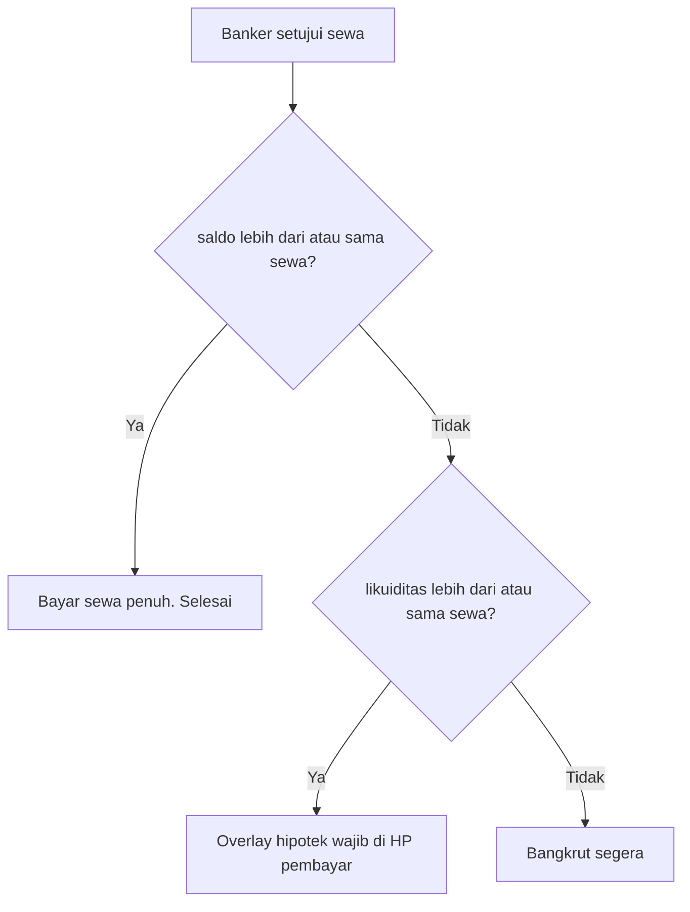

# SDD: Tagihan sewa, hipotek wajib, bangkrut

Dokumen **house rule** aplikasi `bank_monopoly_v1.html`. Melengkapi [aturan-banker-monopoly.md](aturan-banker-monopoly.md) §10 dan [aturan-pemain-monopoly.md](aturan-pemain-monopoly.md).

**Beda dari Monopoly Classic:** jika bangkrut karena utang sewa ke pemain lain, Classic menyerahkan **uang + properti ke kreditur**. Di app ini: **penagih hanya mendapat uang**; semua properti pemain bangkrut kembali ke **bank**.

Belum wajib sudah terpasang di HTML; spesifikasi di bawah untuk implementasi berikutnya.

---

## 1. Istilah

| Istilah | Arti |
| --- | --- |
| Penagih | Pemilik aset yang mengirim request **Tagih sewa** |
| Pembayar | Pemain yang dipilih sebagai yang mendarat |
| Sewa | Nominal `calcRent` saat banker **Setujui** |
| Hipotek wajib | Hipotek yang dieksekusi langsung (tanpa antrian request baru) sampai saldo cukup untuk sewa |
| Likuiditas | Saldo tunai + nilai hipotek semua tanah milik yang **belum** hipotek (setelah bangunan dijual jika perlu) |

---

## 2. Likuiditas

```
likuiditas = saldo
           + Σ mortgage tanah milik, mortgaged = false
             (setelah rumah/hotel di set itu dijual ke bank jika masih ada)
```

- Nilai hipotek tanah = **50%** harga beli (`properties[].mortgage`), sama seperti app sekarang.
- Tanah dengan rumah/hotel: jual bangunan ke bank dulu (**50%** harga rumah/hotel), baru tanah itu masuk hitungan hipotek. Selaras SOP even-build / hipotek di aturan banker.
- Tanah yang sudah `mortgaged` tidak menambah likuiditas.
- Bank selalu bisa membayar hasil hipotek.

Hitung likuiditas **saat request sewa dibuat** (peringatan opsional) dan **wajib saat banker Setujui** (keputusan alur).

---

## 3. Cabang setelah banker Setujui sewa



| Kondisi | Aksi |
| --- | --- |
| `saldo >= sewa` | Potong sewa seperti sekarang. Overlay uang: *Kamu membayar / menerima sewa*. |
| `saldo < sewa` dan `likuiditas >= sewa` | Request sewa **tetap approved**. State `debtSettlement` aktif. Pembayar **wajib** hipotek sampai `saldo >= sewa`, lalu sewa dipotong otomatis. |
| `likuiditas < sewa` | **Bangkrut** tanpa overlay hipotek. |

Banker yang menekan Setujui tidak menolak sewa hanya karena saldo tunai kurang, jika likuiditas masih cukup.

---

## 4. Overlay hipotek wajib (HP pembayar)

Syarat tampil: `debtSettlement.status === 'choosing_mortgage'` dan sesi = `payerId`.

- Daftar hanya aset **milik pembayar**, belum hipotek. Jika masih ada rumah/hotel di set, tampilkan dulu aksi **jual bangunan** (langsung, tanpa request) sampai tanah bisa dihipotekkan.
- Ketuk tanah = `mortgageProp` langsung: `bank → pembayar`, `mortgaged = true`. Bukan request `mortgage` ke antrian banker.
- Overlay **tidak bisa ditutup** sampai: (a) `saldo >= sewa`, atau (b) tidak ada aset tersisa yang bisa dihipotekkan.
- Setelah (a): jalankan pembayaran sewa penuh (`pembayar → penagih`), hapus `debtSettlement`, overlay FX sewa.
- Setelah (b) dan `saldo < sewa`: prosedur bangkrut.
- HP banker: overlay info *Menunggu hipotek wajib — [nama pembayar]*, tanpa Setujui/Tolak ulang.
- HP penagih: overlay FX belum sewa penuh; boleh toast *Menunggu hipotek*.

---

## 5. Bangkrut karena utang sewa

Urutan wajib:

1. `players[].bankrupt = true`. Pemain tidak mengirim request baru (mode lihat).
2. Uang ke penagih: `bayar = min(saldo_pembayar, sewa)`. Saldo pembayar menjadi **0**.
   - Jika bangkrut karena likuiditas kurang dari awal, `bayar` hampir selalu **kurang dari sewa**. Penagih **tidak** mendapat properti sebagai ganti kekurangan.
   - Nominal sewa penuh hanya jika setelah hipotek wajib `saldo >= sewa` (itu bukan bangkrut).
3. Semua properti `ownerId === pembayar`: `ownerId = null`, `houses = 0`, `hotel = false`, `mortgaged = false` (kembali ke bank, siap beli/lelang).
4. Riwayat: hipotek wajib (jika ada) → sewa (jumlah `bayar`) → transaksi `bangkrut` (reason jelas).
5. Overlay FX: konteks bangkrut + sewa sebagian jika `bayar > 0`.

Pemenang meja tetap: pemain terakhir yang tidak bangkrut (aturan banker §10).

---

## 6. State usulan (`save/game.json` / localStorage)

```text
debtSettlement: null | {
  payerId,
  ownerId,
  amount,          // sewa yang harus dibayar
  propertyId,      // aset yang ditagih
  status: "choosing_mortgage",
  startedAt
}
```

- `null` jika tidak ada utang sewa menggantung.
- Poll perangkat lain harus menampilkan overlay yang sama.
- Reset game menghapus `debtSettlement`.

Request sewa yang sudah `approved` tidak diubah statusnya saat hipotek wajib; penyelesaian uang ditunda sampai overlay selesai atau bangkrut.

---

## 7. Yang tidak diubah dokumen ini

- Rumus sewa (set warna, stasiun, utilitas, hipotek = sewa $0).
- Tagih sewa hanya oleh pemilik + persetujuan banker.
- Utang ke **bank** (pajak, beli, tebus): tetap SOP banker Classic (aset ke bank / lelang). Boleh dipisah di implementasi nanti.
- Tombol **Tandai bangkrut** banker manual tetap ada; jika dipakai, ikuti §10 Classic atau house rule ini — implementasi harus memilih satu; default house rule ini untuk utang sewa.

---

## 8. Referensi

- Banker umum: [aturan-banker-monopoly.md](aturan-banker-monopoly.md)
- Pemain: [aturan-pemain-monopoly.md](aturan-pemain-monopoly.md)
- App: `bank_monopoly_v1.html`
