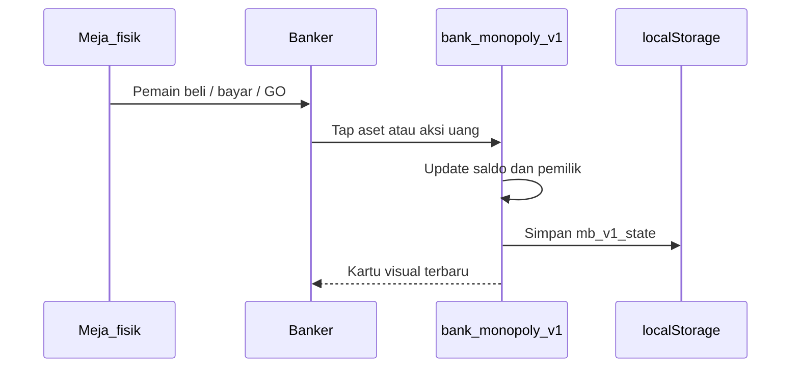

# SDD: Aturan Operasional Banker Monopoly Classic

Dokumen ini untuk **admin / pengelola game / banker**. Fokusnya: apa yang harus dicatat, kapan uang berpindah, dan bagaimana aset pemain berubah. Sumber aturan: **Hasbro Monopoly Classic** (papan Atlantic City), selaras dengan aplikasi `bank_monopoly_v1.html`.

Banker **tidak bermain sebagai bank**. Bank tidak bangkrut. Bank selalu bisa membayar gaji, membeli kembali hipotek, dan menjual properti/rumah/hotel yang masih tersedia.

---

## 1. Peran banker

| Tugas | Di papan fisik | Di aplikasi |
| --- | --- | --- |
| Membayar gaji lewat GO | Serahkan $200 | Aksi **GO** |
| Menjual properti yang belum dimiliki | Ambil uang, serahkan kartu | **Beli** pada kartu aset |
| Menjual rumah/hotel | Ambil uang, taruh bangunan | **Bangun** pada aset |
| Membayar hipotek / tebus | Serahkan atau terima uang | **Hipotek** / **Tebus** |
| Menerima pajak, denda, kartu | Ambil uang pemain | **Bayar bank** |
| Mencatat sewa antar pemain | Pemain bayar langsung | **Sewa** (hitung otomatis) atau **Transfer** |
| Lelang | Tawarkan ke semua pemain | Beli dengan harga lelang (isi jumlah manual) |
| Bangkrut | Pindahkan aset | Tandai bangkrut + lepas/alih aset |

Banker **tidak perlu** menggerakkan pion. Banker hanya menjaga **uang dan aset** agar sesuai papan.

---

## 2. Setup permainan

- Pemain: **2 sampai 8**.
- Uang awal tiap pemain: **$1.500** (boleh diubah di Pengaturan aplikasi sebelum mulai).
- Banker dipilih dulu; boleh ikut main, tetapi transaksi bank harus tetap dicatat.
- Setiap pemain dapat: 1 pion, 1 lembar catatan mental; **kartu properti** diwakili di layar **Papan aset**.
- Urutan giliran: lempar dadu; tertinggi mulai. Selanjutnya sesuai arah papan (biasanya searah jarum jam).
- Bank memegang: sisa uang (tidak dilacak sebagai saldo di app), 32 rumah, 12 hotel, kartu properti yang belum dibeli.

**Checklist mulai game di app**

1. Buka `bank_monopoly_v1.html` di browser HP (data tersimpan di **localStorage** browser itu).
2. Tambah semua pemain (saldo default $1.500).
3. Pastikan papan aset kosong (tidak ada pemilik).
4. Mulai giliran; setiap pembayaran/pembelian dicatat segera.

---

## 3. Nominal tetap (cepat)

| Peristiwa | Jumlah | Arah uang |
| --- | --- | --- |
| Lewat atau mendarat di GO | $200 | Bank → pemain |
| Income Tax | $200 | Pemain → bank |
| Luxury Tax | $100 | Pemain → bank |
| Keluar penjara (bayar) | $50 | Pemain → bank |
| Hipotek | 50% harga beli | Bank → pemain |
| Tebus hipotek | Hipotek + 10% | Pemain → bank |
| Jual rumah ke bank | 50% harga rumah | Bank → pemain |

Rumah/hotel: stok terbatas (32 rumah, 12 hotel). Jika stok habis, tidak boleh bangun sampai ada yang dijual ke bank.

---

## 4. Alur uang yang wajib dicatat

Setiap peristiwa di bawah **harus** masuk riwayat aplikasi.

### 4.1 Bank → pemain

- Gaji GO ($200).
- Kartu Chance / Community Chest yang membayar pemain.
- Hasil hipotek.
- Penjualan rumah/hotel kembali ke bank (setengah harga).
- Pengembalian properti ke bank tidak memberi uang kecuali ada hipotek yang sudah dicairkan (ikuti aturan bangkrut).

### 4.2 Pemain → bank

- Beli properti (harga tercetak, atau harga lelang).
- Beli rumah/hotel.
- Income Tax, Luxury Tax.
- Tebus hipotek (pokok + 10%).
- Denda kartu, biaya keluar penjara $50.
- Denda lain yang disebut kartu.

### 4.3 Pemain → pemain

- Sewa tanah / stasiun / utilitas.
- Perdagangan (uang +/atau aset).
- Kartu “bayar pemain lain”.

---

## 5. Properti: beli, lelang, sewa

### 5.1 Mendarat di properti belum dimiliki

Pemain **wajib** memilih:

- **Beli** seharga tercetak, atau
- **Tolak** → banker **melelang** ke semua pemain (termasuk yang mendarat). Penawaran mulai di bawah atau sesuai kesepakatan meja; pemenang membayar bank, menjadi pemilik.

Di app: **Beli** → pilih pemain + isi harga (default = harga tercetak; untuk lelang ubah jumlah).

### 5.2 Sewa tanah (color set)

- Properti **hipotek**: sewa **$0**. Jangan catat sewa.
- Tanpa rumah: sewa dasar. Jika pemilik punya **seluruh set warna** dan **tidak ada** tanah set itu yang hipotek, sewa kosong **dikali 2**.
- Dengan 1–4 rumah atau hotel: pakai kolom tabel (bukan kali dua).
- Pemilik harus **mengklaim** sewa sebelum pemain berikutnya melempar dadu. Jika terlewat, sewa hangus (opsional house rule; default resmi: klaim sebelum dadu berikutnya).

### 5.3 Stasiun (Railroad)

Sewa tergantung **berapa stasiun dimiliki pemilik yang sama** (bukan yang mendarat):

| Jumlah stasiun | Sewa |
| --- | --- |
| 1 | $25 |
| 2 | $50 |
| 3 | $100 |
| 4 | $200 |

Stasiun hipotek tidak dihitung milik untuk sewa, dan tidak menagih sewa.

### 5.4 Utilitas

- 1 utilitas: sewa = **4 ×** jumlah dadu yang baru dilempar.
- 2 utilitas (keduanya milik orang yang sama, tidak hipotek): **10 ×** dadu.

Di app: buka utilitas → **Sewa** → isi hasil dadu.

### 5.5 Perdagangan antar pemain

Boleh tukar properti ± uang ± kartu “Get Out of Jail Free”.  
Syarat pembangunan: setelah tukar, **even-build** tetap berlaku.  
Di app: pindahkan pemilik aset (jual/transfer aset) lalu **Transfer** uang jika ada selisih.

---

## 6. Rumah dan hotel

- Bangun hanya jika pemilik punya **set warna lengkap**.
- **Even-build**: tidak boleh ada tanah dengan selisih lebih dari 1 rumah dibanding tanah lain di set yang sama.
- Harga rumah = `houseCost` set (lihat tabel). Hotel = 4 rumah + 1 pembayaran `houseCost` lagi (ganti 4 rumah dengan 1 hotel).
- Hotel hanya jika 4 rumah sudah ada di petak itu.
- Jual rumah ke bank: urutan terbalik (even-sell), bank bayar **setengah** harga rumah.
- Tidak boleh bangun di tanah yang hipotek. Tebus dulu.

Di app: tombol **+ Rumah** / **Hotel** / **− Rumah** pada sheet properti.

---

## 7. Hipotek

- Hipotek = 50% harga beli, dibayar bank ke pemain.
- Semua rumah di **set warna itu** harus dijual ke bank dulu sebelum menghipotekkan salah satu tanah set.
- Selama hipotek: **tidak ada sewa**.
- Tebus: bayar bank **nilai hipotek + 10%**.
- Properti hipotek boleh diperdagangkan; penerima harus segera tebus atau bayar 10% dan biarkan hipotek (aturan resmi: jika tidak tebus saat terima, tetap bayar 10% bunga).

Di app: **Hipotek** / **Tebus** (tebus menghitung +10% otomatis).

---

## 8. Penjara

Masuk penjara: kartu “Go to Jail”, mendarat di Go to Jail, atau 3x dadu kembar berturut-turut.

Di penjara pemain **tidak** melewati GO (tidak dapat $200 untuk langkah ke penjara).

Keluar:

1. Bayar **$50** lalu lempar, atau
2. Pakai Get Out of Jail Free, atau
3. Lempar dadu kembar dalam 3 giliran.

Banker hanya mencatat **$50** jika opsi bayar dipakai (**Bayar bank**, alasan Penjara).

---

## 9. Kartu Chance / Community Chest

Banker **tidak** mengundi kartu. Setelah kartu dibaca:

- Jika uang ke/dari bank → **Bayar bank** atau **Terima bank**.
- Jika bayar pemain lain → **Transfer**.
- Jika “perbaiki rumah” ($25/rumah, $100/hotel, dll.) → hitung bangunan milik pemain, lalu **Bayar bank**.
- Jika pindah ke GO → **GO** (+$200) sesuai kartu.

---

## 10. Bangkrut

Pemain bangkrut jika **tidak mampu** membayar utang setelah menjual rumah dan menghipotekkan aset.

**Utang sewa ke pemain lain (house rule app):** jangan serahkan properti ke kreditur. Ikuti [aturan-bangkrut-sewa.md](aturan-bangkrut-sewa.md): hipotek wajib dulu jika likuiditas cukup; jika tidak, penagih mendapat sisa uang (maks. sewa), **semua properti kembali ke bank**.

**Utang ke pemain lain (Classic, jika tidak pakai house rule sewa):** semua yang dimiliki (uang sisa + properti, hipotek tetap hipotek) diserahkan ke kreditur. Kreditur membayar 10% jika menerima properti hipotek dan tidak langsung tebus.

**Utang ke bank:** uang ke bank; properti dikembalikan ke bank, rumah/hotel ke bank (setengah harga sudah seharusnya dijual dulu). Bank **melelang** properti tersebut.

Di app:

1. Selesaikan transfer aset/uang terakhir.
2. Tandai pemain **Bangkrut** (tidak ikut aksi aktif).
3. Properti tanpa pemilik kembali ke papan (atau pindah ke kreditur).

Pemenang: pemain terakhir yang tidak bangkrut, atau (house rule) aset bersih tertinggi jika permainan dihentikan.

---

## 11. SOP layar aplikasi

| Situasi di meja | Layar | Tombol |
| --- | --- | --- |
| Pemain lewat GO | Transaksi / detail pemain | **GO** |
| Mendarat properti kosong, beli | Papan aset | tap properti → **Beli** |
| Lelang | Papan aset | **Beli**, ubah harga |
| Mendarat milik orang, sewa | Papan aset | **Sewa** (auto) |
| Beli rumah | Papan aset | **+ Rumah** / **Hotel** |
| Hipotek / tebus | Papan aset | **Hipotek** / **Tebus** |
| Pajak | Transaksi | **Bayar bank** (Income/Luxury Tax) |
| Kartu dapat uang | Transaksi | **Terima bank** |
| Jual beli antar pemain (uang) | Transaksi | **Transfer** |
| Tambah orang | Pengaturan / header | **Tambah pemain** |
| Salah catat | Riwayat | tidak ada undo otomatis; koreksi dengan transfer balik |

**Persistensi:** semua state disimpan di `localStorage` kunci `mb_v1_state` pada browser HP yang sama. Refresh tidak menghapus data. Reset hanya dari Pengaturan.

---

## 12. Tabel referensi aset (Classic)

Sewa kolom: Kosong / 1 rumah / 2 / 3 / 4 / Hotel.  
Hipotek = 50% harga. Tebus = hipotek × 1,1.

### Cokelat — rumah $50

| Properti | Harga | Sewa | Hipotek |
| --- | --- | --- | --- |
| Mediterranean Avenue | 60 | 2 / 10 / 30 / 90 / 160 / 250 | 30 |
| Baltic Avenue | 60 | 4 / 20 / 60 / 180 / 320 / 450 | 30 |

### Biru muda — rumah $50

| Properti | Harga | Sewa | Hipotek |
| --- | --- | --- | --- |
| Oriental Avenue | 100 | 6 / 30 / 90 / 270 / 400 / 550 | 50 |
| Vermont Avenue | 100 | 6 / 30 / 90 / 270 / 400 / 550 | 50 |
| Connecticut Avenue | 120 | 8 / 40 / 100 / 300 / 450 / 600 | 60 |

### Pink — rumah $100

| Properti | Harga | Sewa | Hipotek |
| --- | --- | --- | --- |
| St. Charles Place | 140 | 10 / 50 / 150 / 450 / 625 / 750 | 70 |
| States Avenue | 140 | 10 / 50 / 150 / 450 / 625 / 750 | 70 |
| Virginia Avenue | 160 | 12 / 60 / 180 / 500 / 700 / 900 | 80 |

### Oranye — rumah $100

| Properti | Harga | Sewa | Hipotek |
| --- | --- | --- | --- |
| St. James Place | 180 | 14 / 70 / 200 / 550 / 750 / 950 | 90 |
| Tennessee Avenue | 180 | 14 / 70 / 200 / 550 / 750 / 950 | 90 |
| New York Avenue | 200 | 16 / 80 / 220 / 600 / 800 / 1000 | 100 |

### Merah — rumah $150

| Properti | Harga | Sewa | Hipotek |
| --- | --- | --- | --- |
| Kentucky Avenue | 220 | 18 / 90 / 250 / 700 / 875 / 1050 | 110 |
| Indiana Avenue | 220 | 18 / 90 / 250 / 700 / 875 / 1050 | 110 |
| Illinois Avenue | 240 | 20 / 100 / 300 / 750 / 925 / 1100 | 120 |

### Kuning — rumah $150

| Properti | Harga | Sewa | Hipotek |
| --- | --- | --- | --- |
| Atlantic Avenue | 260 | 22 / 110 / 330 / 800 / 975 / 1150 | 130 |
| Ventnor Avenue | 260 | 22 / 110 / 330 / 800 / 975 / 1150 | 130 |
| Marvin Gardens | 280 | 24 / 120 / 360 / 850 / 1025 / 1200 | 140 |

### Hijau — rumah $200

| Properti | Harga | Sewa | Hipotek |
| --- | --- | --- | --- |
| Pacific Avenue | 300 | 26 / 130 / 390 / 900 / 1100 / 1275 | 150 |
| North Carolina Avenue | 300 | 26 / 130 / 390 / 900 / 1100 / 1275 | 150 |
| Pennsylvania Avenue | 320 | 28 / 150 / 450 / 1000 / 1200 / 1400 | 160 |

### Biru tua — rumah $200

| Properti | Harga | Sewa | Hipotek |
| --- | --- | --- | --- |
| Park Place | 350 | 35 / 175 / 500 / 1100 / 1300 / 1500 | 175 |
| Boardwalk | 400 | 50 / 200 / 600 / 1400 / 1700 / 2000 | 200 |

### Stasiun — harga $200, hipotek $100

Reading Railroad, Pennsylvania Railroad, B. & O. Railroad, Short Line.

### Utilitas — harga $150, hipotek $75

Electric Company, Water Works.

---

## 13. Model data aplikasi (untuk pengelola teknis)

Kunci: `localStorage['mb_v1_state']` (JSON).

- `players[]`: `id`, `name`, `color`, `balance`, `bankrupt`
- `properties[]`: `id`, `name`, `group`, `price`, `rentLevels[]`, `houseCost`, `mortgage`, `ownerId`, `houses`, `hotel`, `mortgaged`
- `transactions[]`: `id`, `type`, `from`, `to`, `propertyId`, `amount`, `reason`, `timestamp`
- `settings`: `startingCash`, `goAmount`
- `requests[]`, `lastFx`, `debtSettlement` — utang sewa menggantung: [aturan-bangkrut-sewa.md](aturan-bangkrut-sewa.md)

Satu browser = satu “meja”. Ganti HP atau hapus data situs = game hilang.

---

## 14. Alur kerja banker

