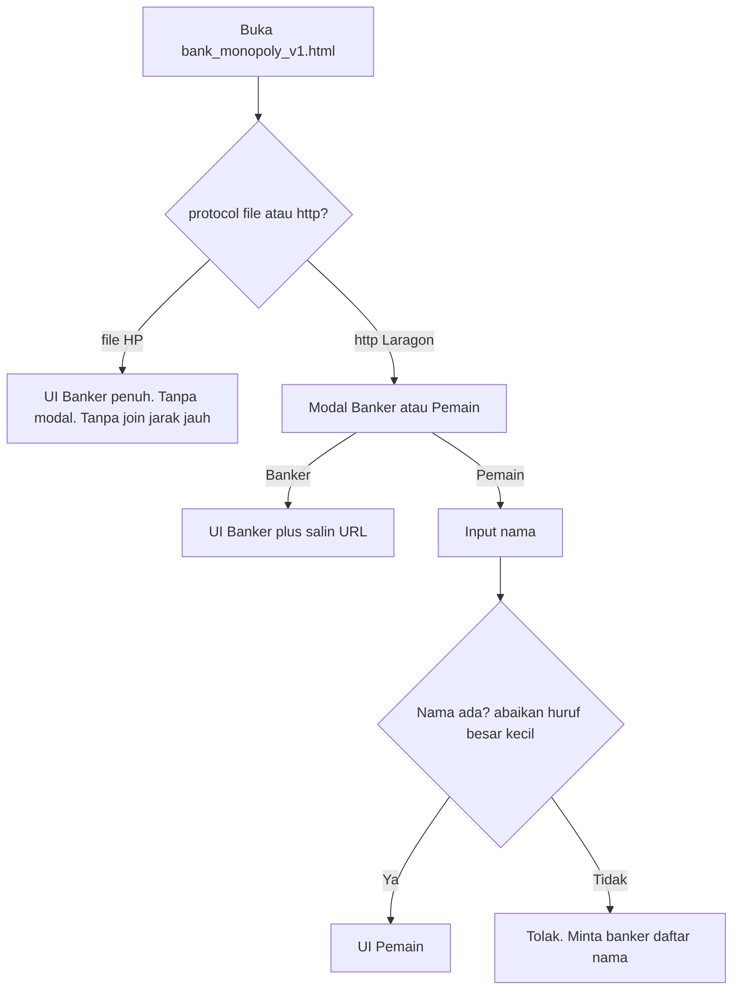
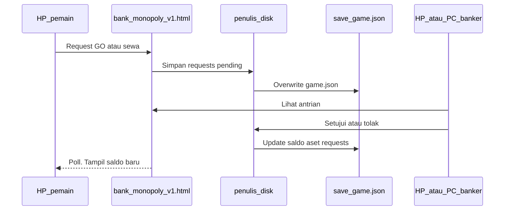

# SDD: Peran Pemain — Monopoly Bank (dual-mode)

Dokumen ini untuk **pemain** (bukan banker) dan untuk pengelola teknis yang akan mengimplementasi UI pemain. Sumber aturan meja: Hasbro Monopoly Classic, selaras dengan [aturan-banker-monopoly.md](aturan-banker-monopoly.md). Aplikasi: **satu file** `bank_monopoly_v1.html`.

Pemain **tidak** mengubah saldo atau pemilik aset secara langsung. Pemain mengirim **permintaan**; banker menyetujui atau menolak. Uang berpindah hanya setelah banker setuju (dan, di mode server, setelah `save/game.json` tertulis).

---

## 1. Dual-mode: HP vs Laragon

Satu HTML, dua cara jalan. Deteksi: `location.protocol === 'file:'` → mode HP. `http:` atau `https:` → mode server.

| Cara buka | Perilaku |
| --- | --- |
| HP, file HTML lokal (`file://`) | **Hanya banker.** Game lengkap di HP itu (`localStorage` kunci `mb_v1_state`). Tidak ada join dari HP lain. **Tidak** muncul modal Banker/Pemain. Field **salin tautan** disembunyikan. Folder `save/` **tidak** dipakai. |
| Laragon `http://` (localhost atau IP LAN) | **Banker + share.** Modal awal Banker / Pemain. Pemain join dengan nama yang sudah didaftar banker. Setelan banker menampilkan **salin URL**. State bersama di `save/game.json`. |

**Konsekuensi:** membuka file di HP banker tidak membuat HP lain di Wi-Fi yang sama masuk ke meja itu. Share hanya jalan jika semua perangkat membuka URL `http` dari host Laragon yang sama.

---

## 2. Peran pemain vs banker

| | Banker | Pemain |
| --- | --- | --- |
| Tambah / hapus pemain, reset game, uang awal, nominal GO | Ya | Tidak |
| Eksekusi GO, sewa, beli, hipotek, transfer | Ya (langsung) | Tidak; kirim request |
| Lihat saldo semua pemain | Ya | Saldo sendiri jelas; orang lain boleh ringkas (nama + saldo) tanpa aksi |
| Papan aset | Beli / bangun / hipotek | Baca; request sewa / beli / bangun |
| Setelan salin URL | Hanya mode `http` | Tidak ada |
| Menyetujui request | Ya | Tidak |

Banker **tidak bermain sebagai bank**. Pemain tidak menggantikan banker.

---

## 3. Modal peran (hanya mode server)

Tampil jika belum ada sesi `mb_v1_session` (perangkat + origin itu).

1. Pilih **Banker** atau **Pemain**.
2. **Banker:** masuk UI pengelola (sama fungsi dengan mode HP, plus salin tautan).
3. **Pemain:** form nama (maks. 24 karakter, sama modal tambah pemain banker). Tidak ada tombol “buat pemain baru”.
4. **Keluar / ganti peran:** hapus sesi → modal muncul lagi. Di UI pemain: aksi **Keluar** (bukan Setelan banker).

Mode HP: lompat langsung ke UI banker; sesi peran tidak diperlukan.

---

## 4. Join nama pemain

1. Banker sudah menambah nama di UI banker (sebelum atau saat game).
2. Pemain membuka URL share, pilih Pemain, isi nama.
3. Cocokkan `name.trim()` ke `players[].name` dengan perbandingan **tidak case-sensitive** (contoh: `Budi` = `budi`).
4. Tidak ketemu: tetap di form; pesan *Nama belum terdaftar. Minta banker menambah pemain.* Tidak masuk UI pemain.
5. Ketemu: simpan sesi `{ role: 'player', playerId, name }` di `sessionStorage` atau `localStorage` kunci `mb_v1_session`.
6. Nama bangkrut: boleh masuk **hanya lihat**; tidak kirim request baru.

Pemain **tidak** boleh mendaftarkan diri.

---

## 5. UI/UX pemain (berbeda dari banker)

Navigasi bawah **bukan** Pemain / Aset / Kas / Setelan.

| Tab | Isi |
| --- | --- |
| **Beranda** | Request GO, Bayar bank, Terima bank, Transfer. Daftar pemain. Header: badge nama + saldo. |
| **Aset** | Properti `ownerId === session.playerId`. Tap: info + request bangun / hipotek / tebus (bukan eksekusi). |
| **Papan** | Grid aset. Kosong: **Request beli**. Milik Anda: **Tagih sewa** (pilih pemain yang mendarat) + bangun/hipotek. Tamu tidak mengirim sewa. |
| **Antrian** | Request saya + riwayat transaksi seluruh meja. |
| **Setelan** | Warna pion, senyap suara, Keluar. |

Header: badge nama (warna pion) + saldo. Chip **PEMAIN** di subtitle.

---

## 6. Permintaan (request)

Hanya mode server. Mode HP tidak memakai antrian ini.

Setiap item:

| Field | Isi |
| --- | --- |
| `id` | Unik |
| `playerId` | Pemain pengirim |
| `type` | `go` \| `pay_bank` \| `recv_bank` \| `transfer` \| `rent` \| `buy` \| `build` \| `mortgage` \| `unmortgage` |
| `payload` | `amount`, `toPlayerId`, `payerId` (tagih sewa), `propertyId`, `dice`, `reason` sesuai jenis |
| `status` | `pending` \| `approved` \| `rejected` |
| `createdAt` | Waktu kirim |
| `resolvedAt` | Waktu banker memutus |
| `bankerNote` | Alasan tolak (opsional) |

Satu pemain boleh punya beberapa `pending`. Saldo/aset **tidak** berubah sampai status `approved` dan banker (atau logika setuju) menulis state.

Jika request **rent** disetujui tetapi saldo pembayar kurang, ikuti [aturan-bangkrut-sewa.md](aturan-bangkrut-sewa.md) (hipotek wajib atau bangkrut).

Alur:

SOP nominal (GO, pajak, sewa) tetap di dokumen banker; pemain hanya mengusulkan kejadian di meja.

---

## 7. Salin tautan (Setelan banker, mode `http` saja)

Letak: layar Setelan banker, **sebelum** field uang awal.

- Label: **Tautan untuk pemain**
- Input readonly: `origin + pathname` (contoh `http://192.168.x.x/web-iseng/Monopoly%20Bank/bank_monopoly_v1.html`)
- Tombol **Salin tautan** (`navigator.clipboard`, fallback `execCommand`)
- Bantuan: *Bagikan ke perangkat di Wi-Fi yang sama. Pemain memilih peran Pemain lalu mengisi nama yang sudah Anda daftarkan.*
- Banker sebaiknya membuka app lewat **IP LAN PC Laragon**, bukan hanya `localhost`, agar HP lain bisa memakai tautan yang sama.
- Mode `file://`: blok ini **tidak ditampilkan**.

---

## 8. Folder `save/` (mode server)

Path: folder yang sama dengan HTML, subfolder `save/`.

| Item | Fungsi |
| --- | --- |
| `save/game.json` | State bersama: `players`, `properties`, `transactions`, `settings`, `requests[]` (dan field app yang sudah ada, mis. `colorIndex`) |
| `save/.gitkeep` | Opsional, agar folder ada di git. Isi JSON meja **tidak** wajib di-commit |

Perilaku:

- Folder `save` **dibuat otomatis** saat simpan pertama jika belum ada.
- Setiap perubahan: **overwrite** `game.json` (bukan database).
- File belum ada: game kosong sampai banker pertama kali simpan.
- Perangkat lain **poll / fetch** berkala agar UI ikut.

**Penulis disk:** JavaScript di browser tidak bisa `mkdir` atau menulis `C:\laragon\www\...`. Satu **PHP kecil** di folder HTML (bukan halaman UI) yang membuat `save/` dan menulis JSON. Tanpa itu, tiap HP punya `localStorage` sendiri dan bukan satu meja.

Mode HP: abaikan `save/`; tetap `localStorage['mb_v1_state']`.

---

## 9. Model sesi perangkat

| Kunci | Kapan | Isi |
| --- | --- | --- |
| `mb_v1_state` | Mode HP, dan cache lokal opsional | State game (HP) |
| `mb_v1_session` | Mode server setelah pilih peran | `role`: `banker` \| `player`; jika player: `playerId`, `name` |

Refresh di mode server: jika sesi pemain ada, **jangan** tampilkan modal lagi sampai Keluar.

---

## 10. Yang tidak boleh dilakukan pemain

- Membuat pemain baru, hapus pemain, reset game.
- Mengubah uang awal / nominal GO.
- Menyetujui request orang lain.
- Mengandalkan share URL dari `file://`.

---

## 11. Referensi

- Banker: [aturan-banker-monopoly.md](aturan-banker-monopoly.md), [cheatsheet-banker.md](cheatsheet-banker.md)
- Pemain ringkas: [cheatsheet-pemain.md](cheatsheet-pemain.md)
- Sewa tidak cukup / bangkrut: [aturan-bangkrut-sewa.md](aturan-bangkrut-sewa.md)
- App: `bank_monopoly_v1.html`
